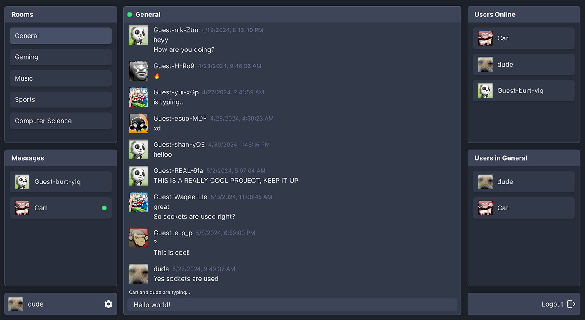

# messaging-app

Site is currently deployed [here](https://messaging-app-uz05.onrender.com).

This monorepo is made for deploying my messaging-app-backend and
messaging-app-frontend to hosting providers.

This app is an online chatroom where registered users and unregistered guests
can enter and chat in one of five chatrooms. Chatters can also directly message
each other. Profiles can be customized with a bio and a selection of 1 of 14
avatars.

# Local Installation

1. Clone this repository

2. Navigate to the project in terminal and run the build script

```console
$ cd messaging-app && pnpm run build
```

2. Navigate to the backend folder and create a .env file. Add a secure SECRET variable and a MONGODB_URI variable containing your mongoDB connection string

```console
$ cd backend && touch .env
```

3. Navigate to the root directory and run the start script

```console
$ pnpm run start
```

4. Open localhost:3000 in your browser to view the project


